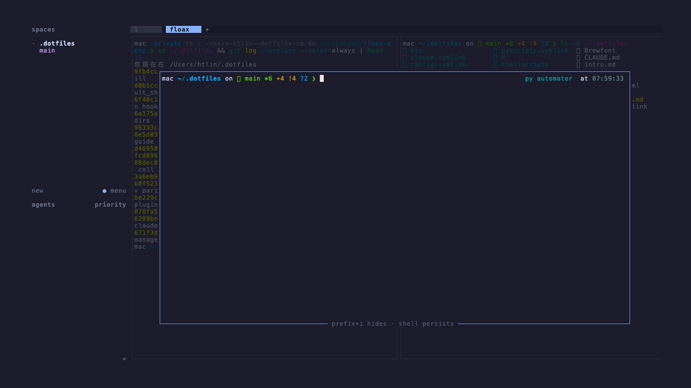

# herdr-floax

A floating scratch shell for the current [herdr](https://herdr.dev) workspace —
the [`tmux-floax`](https://github.com/omerxx/tmux-floax) / `tmux popup`
experience, rebuilt for herdr.

One keybinding toggles a centered floating shell **over your real workspace,
dimmed** — not a dead-colored fill. The popup is a fully interactive login
shell (vim, REPLs, paste, truecolor all work) and its session persists across
toggles.



*The box floats over a snapshot of your actual panes — text dimmed, layout,
borders, and background colors preserved.*

> This is [htlin222](https://github.com/htlin222)'s fork of
> [Tyru5/herdr-floax](https://github.com/Tyru5/herdr-floax). Everything in
> [What the fork adds](#what-the-fork-adds) is on top of the upstream plugin.

## Quick start

```sh
herdr plugin install htlin222/herdr-floax

# install the default keybind (prefix+f) and reload herdr config:
bash "$(herdr plugin list --plugin herdr-floax --json | jq -r '.result.plugins[0].plugin_root')/scripts/install-keybinding.sh"
```

Requires a Rust toolchain (`cargo`) to build at install time, and
[`jq`](https://jqlang.github.io/jq/) for the toggle script.

Press the key:

- **no floating pane yet** → opens the popup over your dimmed workspace
- **focused on it** → dismisses it (the shell session survives)
- **exists but you moved away** → closes the stale one and reopens where you
  are, with a fresh backdrop

One independent floating shell per workspace.

## What the fork adds

### A real "floating over your workspace" backdrop

Upstream's backdrop is a solid dark fill — herdr gives a plugin no way to
composite over other panes' live PTYs. The fork gets the tmux-popup look
anyway: just before opening, the toggle script snapshots every pane of the
current tab (`herdr pane layout` for geometry, `herdr pane read --format ansi`
for the visible screens) and the app paints that capture behind the box:

- only the **text** is dimmed (fg ≈ 40%); background colors — including
  default/terminal — pass through untouched, so nothing looks patchy
- multi-pane layouts get their **pane borders redrawn** in a muted tone, and
  content sits at its true 1-cell-inset position — the dimmed layout mirrors
  the real one exactly
- it is a still of open time (that's all a plugin can get); the solid
  `backdrop` fill remains as the no-snapshot fallback

### Pixel-exact placement

The popup opens as a **borderless single-pane tab** (`--placement tab`)
instead of upstream's split+zoom. herdr draws single-pane tabs over the full
tab area, so the backdrop lines up 1:1 with where your panes actually were —
a zoomed split gets wrapped in a 1-cell herdr pane border that crops and
offsets everything by one row/column. The pane and its tab are named
`floax`.

### A persistence layer that doesn't mangle colors

The scratch shell runs inside a dedicated multiplexer session so it survives
dismiss/reopen (`dtach` → `abduco` → `tmux`, first found; plain login shell
otherwise). The tmux path now loads its own minimal config
(`scripts/floax-tmux.conf`): truecolor passthrough (`RGB`
terminal-overrides), **no status bar**, zero escape-time, and it never reads
your `~/.tmux.conf`. Without this, prompts that paint explicit
terminal-matching backgrounds get 256-color-approximated and show up as
off-color stripes inside the box. `COLORTERM=truecolor` is exported for the
same reason.

### Native-modal styling, configurable

New `floax.conf` keys (all optional, upstream defaults preserved):

| Key | Default | What it does |
|---|---|---|
| `border` | terminal magenta | Border color as `#rrggbb`. `#89b4fa` matches herdr's own modal chrome (catppuccin accent). |
| `border_type` | `rounded` | `plain` for square corners, like herdr's native dialogs. |
| `box_bg` | unset | Explicit box background. Unset passes default bg through to the host terminal — usually what you want (see the stripes note above). |
| `title` | unset | Top-border title. Unset draws a clean border line, no title. |

## Configuration

Copy `floax.conf.example` to the plugin config dir
(`herdr plugin config-dir herdr-floax`, usually
`~/.config/herdr/plugins/config/herdr-floax/floax.conf`). Values are re-read
every time the popup opens — no reload needed.

```conf
width_pct = 90        # box size, % of the pane area (20–100)
height_pct = 80
key_hint = prefix+i   # shown in the bottom border (display only)
backdrop = #0a0a10    # no-snapshot fallback fill
border = #89b4fa
border_type = plain
```

Every key has a per-invocation env override: `HERDR_FLOAX_WIDTH_PCT`,
`HERDR_FLOAX_HEIGHT_PCT`, `HERDR_FLOAX_KEY_HINT`, `HERDR_FLOAX_BACKDROP`,
`HERDR_FLOAX_BORDER`, `HERDR_FLOAX_BORDER_TYPE`, `HERDR_FLOAX_TITLE`,
`HERDR_FLOAX_BOX_BG`.

## Keybinding

The installer defaults to **`prefix+f`**:

```sh
scripts/install-keybinding.sh prefix+i          # pass a key
HERDR_FLOAX_KEY=prefix+i scripts/install-keybinding.sh
```

…or add the block by hand in `~/.config/herdr/config.toml` and reload:

```toml
[[keys.command]]
key = "prefix+i"
type = "plugin_action"
command = "herdr-floax.toggle"
description = "Toggle floating pane"
```

## How it works

The pane runs a small Rust TUI (`ratatui` + `portable-pty` + `vt100`) that
draws the box and embeds a real shell PTY inside it. Input is raw byte
passthrough — no key-event translation, so nothing is lost. herdr's prefix
key never reaches the box (herdr intercepts it), which is what keeps the
toggle working while the shell is focused.

Open flow, in `scripts/toggle-floating.sh`:

1. capture the current tab's layout + visible pane screens into a snapshot
   file (`AREA`/`PANE` header lines + raw ANSI, parsed by `src/snapshot.rs`)
2. `herdr plugin pane open --placement tab --focus`, passing the launch
   directory and snapshot path via `--env`
3. name the pane/tab `floax`, remember the pane id in a per-workspace state
   file (used to find it again on the next toggle)

Dismiss closes the pane (its single-pane tab closes with it); the detached
multiplexer session keeps the shell alive for the next open.

## Files

| File | Purpose |
|---|---|
| `herdr-plugin.toml` | Manifest: the `[[panes]]` TUI app, the `toggle` action, the cargo build. |
| `src/main.rs` | PTY plumbing, event loop, resize. |
| `src/ui.rs` | Box chrome, dimmed-snapshot backdrop, vt100 cell rendering. |
| `src/snapshot.rs` | Snapshot file parsing (geometry + ANSI screens). |
| `src/config.rs` | `floax.conf` + `HERDR_FLOAX_*` env resolution. |
| `scripts/toggle-floating.sh` | The action: open ↔ reopen ↔ dismiss, per workspace. |
| `scripts/floating-shell.sh` | The embedded program: login shell in a detach session. |
| `scripts/floax-tmux.conf` | Minimal config for the tmux persistence layer. |
| `scripts/install-keybinding.sh` | Idempotently installs the keybind. |
| `floax.conf.example` | Annotated configuration template. |

## Credits

Forked from [Tyru5/herdr-floax](https://github.com/Tyru5/herdr-floax);
inspired by [omerxx/tmux-floax](https://github.com/omerxx/tmux-floax) and the
classic persistent `tmux popup` pattern. MIT licensed (see `LICENSE`).
